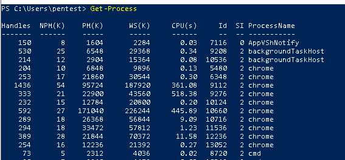
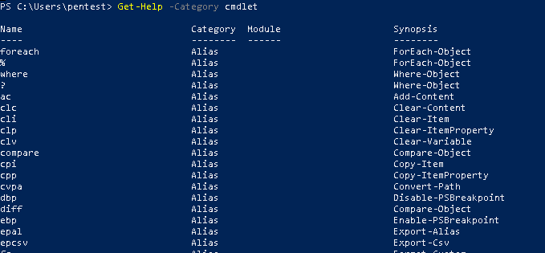
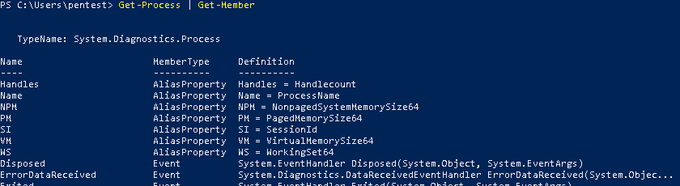

# Powershell Notes
## PowerShell Cmdlets

A cmdlet is a Powershell command with a predefined function, similar to an operator in a programming language.

- There are system, custom and user cmdlets.
- Output : as an object or array of objects.
- can use pipes to get data for analysis or transfer to another cmdlet.
- Case-insensetive
- use semicolon (;) to use multiple cmdlets in single string

A cmdlet always consists of a verb, e.g.,
- **Get** - To get something
- **Set** - To define something
- **Start** - To run something
- **Stop** - To stop a running task
- **Out** - To output something
- **New** - To create something

Example - 

- **Get-Process** - Shows the processes currently running on your computer.

- **Get-Service** - Shows the list of services with their status
- **Get-Content** — Shows the content of the file you specify (for example, Get-Content C:\Windows\System32\drivers\etc\hosts)

**Fun Fact!** -
You don't need to memorize all cmdlets. You can list all cmdlets by executing the **Get-Help -Category cmdlet**, which will return the following -

**NOTE:** You can also create your own custom cmdlets.

Each cmdlet has several parameters that customize what it does. The PowerShell ISE will automatically suggest all valid parameters and their types after you type a cmdlet and a hyphen (-)

If you forget a cmdlet's parameters, just use a script like the following, which will display the parameters for the Get-Process cmdlet:

```
Get-Process | Get-Member
```
 


If you still don't find the cmdlet you need, you can make sure the help is current and then get examples for a cmdlet (such as Get-Process) using a script like this:

```
Update-Help #to update the help data
Get-Help Get-Process -Examples
```

You can also use aliases, which are shortened cmdlet names. For instance, instead of **Get-Help** you can use just **Help**. Try running the following two commands and see whether you get the same result:

```
#1 Start-Process notepad
#2 start notepad
```

Similarly, to stop this process, you can use either of the following commands:

```
#1 Stop-Process -Name notepad
#2 spps -Name notepad
```

To see all aliases available already, execute the **Get-Alias** cmdlet.


